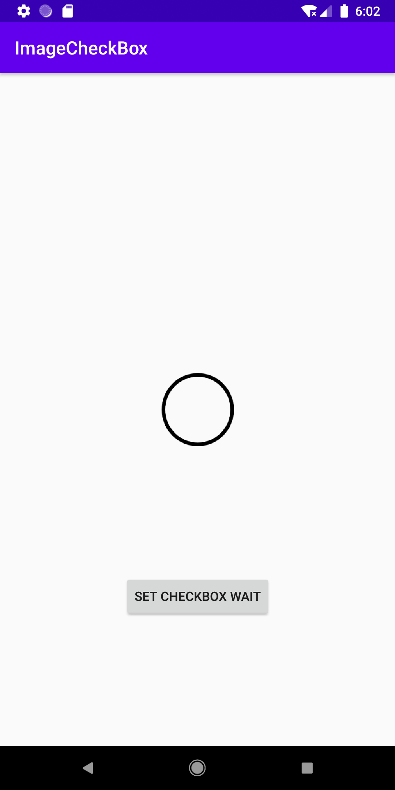
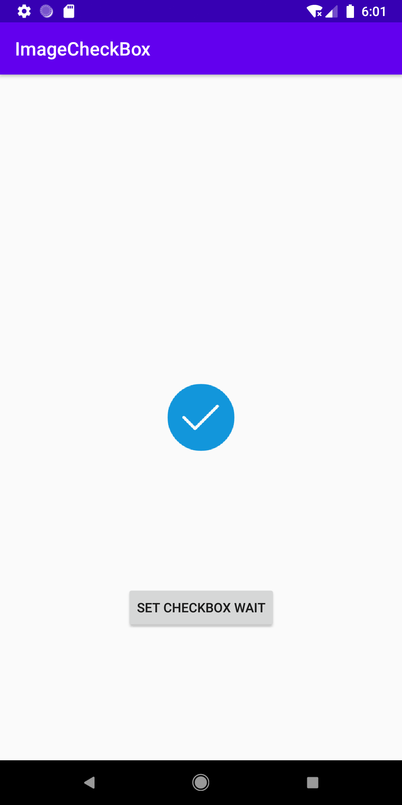
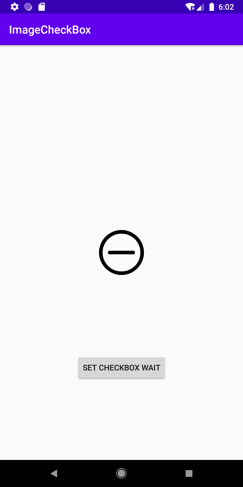

# [](https://jitpack.io/#Dboy233/ImageCheckBox)
## ImageCheckBox

```
 allprojects {
		repositories {
			...
			maven { url 'https://jitpack.io' }
		}
	}

 dependencies {
	      implementation 'com.github.Dboy233:ImageCheckBox:{latest release}'
 }
```

## 可以设置三种状态图片的CheckBox

```
        onDrawable 开启/选中状态
        offDrawable 关闭/未选中状态
        waitDrawable 介于开启和关闭之间的状态，等待/未全选状态

         app:onDrawable="@mipmap/ic_image_check_on"
         app:offDrawable="@mipmap/ic_image_check_off"
         app:waitDrawable="@mipmap/ic_image_wait"
         app:checked="true"
```

    


